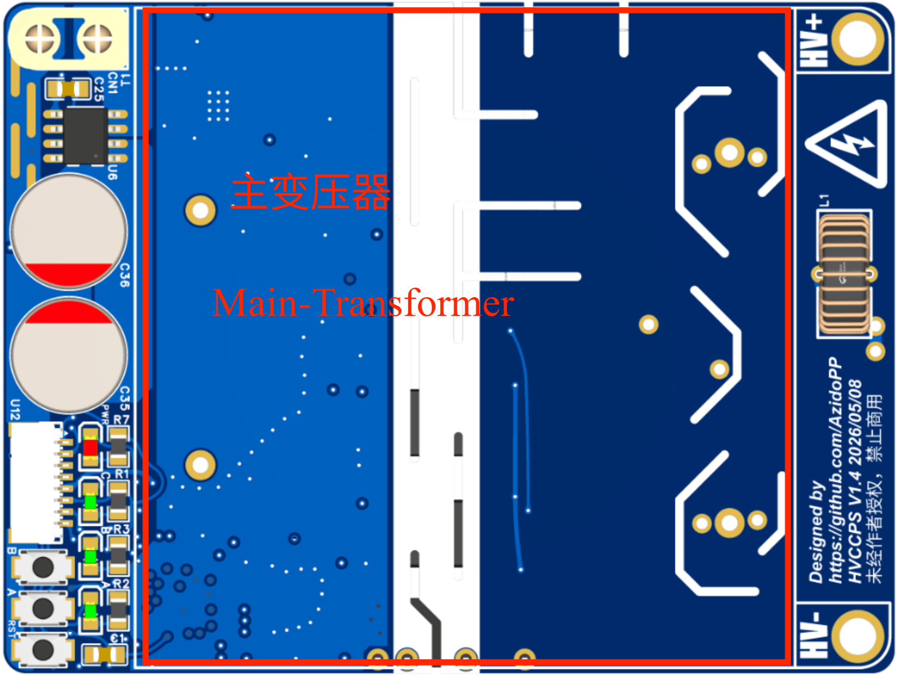
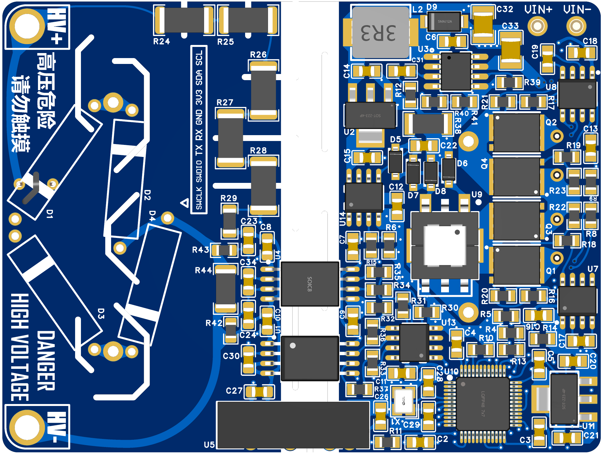
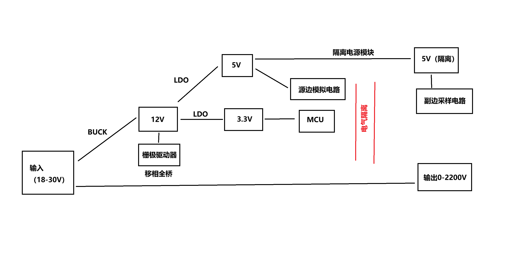
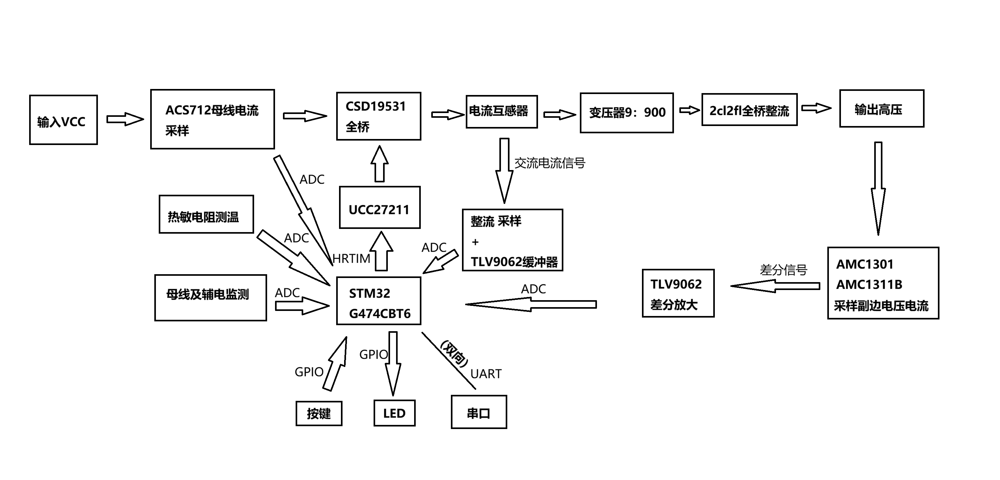
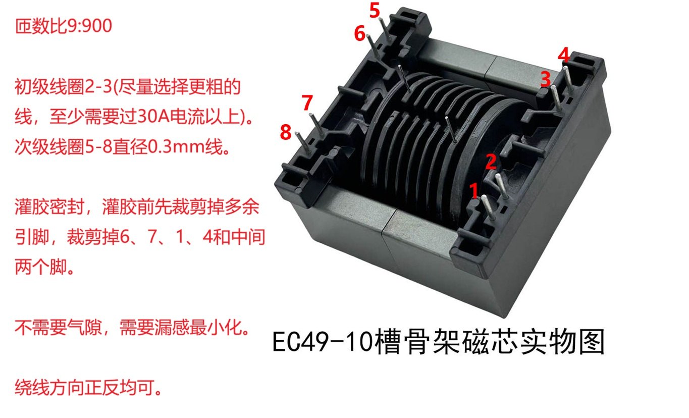
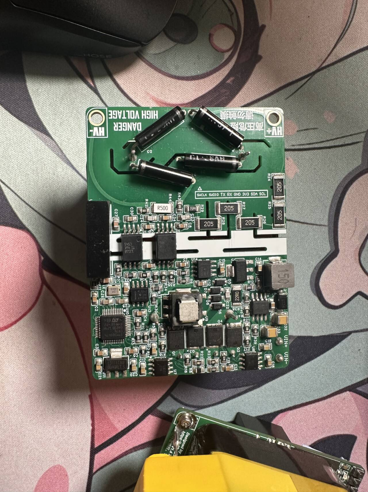
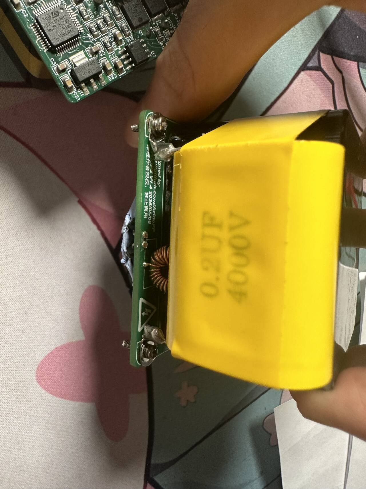

# HVCCPS V1.4

> [!CAUTION]
> 本项目涉及致命高压。设备断电后，输出端及外接电容仍可能储存大量能量。调试和使用前，请确保绝缘、接地、放电、电流限制及外部急停措施齐备；请勿在缺乏高压操作经验或无人监护的情况下使用。

## 1. 项目简介

### 1.1 项目概述

HVCCPS V1.4 是一款基于 **STM32G474CBT6** 的数控高压 DC-DC 电源，功率级采用 **PSFB（Phase-Shifted Full Bridge，移相全桥）** 拓扑。它可用于高压电容充电及实验室高压供电，公开固件支持 **CV（恒压）、CC（恒流）和 CP（恒功率）** 控制。

在推荐工作条件下，电源输入为 18–28 V DC（推荐 24 V），公开固件将输出限制在 **0–2200 V、0–200 mA、0–400 W**。项目功率密度约为 **40 W/in³**。

PCB 使用 EasyEDA（立创 EDA 专业版）设计，仓库提供完整的 [EasyEDA 工程文件](PCB/ProPrj_HVCCPS_V1.4_Release.epro2)、[Gerber 制板文件](PCB/Gerber_HVCCPS_V1.4.zip)和 [BOM](Docs/BOM.xlsx)，便于复刻与二次开发。

### 1.2 固件与许可证说明

公开仓库提供编译后的 Bootloader 和 App HEX 固件。固件源码不直接放在公开分支中；如需源码，可加入 QQ 群 **582594264**，或发送邮件至 **Lanyyontop@gmail.com** 免费获取。

本仓库公开内容采用 [GPL-3.0](LICENSE) 许可证。获取、修改或再分发源码及衍生作品时，请遵守许可证条款。

## 2. 技术参数

### 2.1 电气参数

以下参数适用于默认 **1:100** 变压器及公开发布固件。实际性能会受到输入电压、开关频率、变压器、散热和负载条件影响。

| 参数 | 最小值 | 典型值 | 最大值 | 单位 | 说明 |
|---|---:|---:|---:|:---:|---|
| 输入电压（DC） | 18 | 24 | 28 | V | 推荐工作范围；硬件资料上限为 30 V |
| 输入电流（DC） | 0 | — | 20 | A | 原边额定输入电流 |
| 输出电压（DC） | 0 | 可调 | 2200 | V | 公开固件 CV 目标范围 |
| 输出电流（DC） | 0 | 可调 | 200 | mA | 公开固件 CC 目标范围 |
| 输出功率（DC） | 0 | 可调 | 400 | W | 公开固件 CP 目标范围 |
| 开关频率 | 11 | 35 | 45 | kHz | 默认自动变频，35 kHz 为基准频率 |
| 栅极驱动死区 | — | 200 | — | ns | HRTIM 固定死区 |
| 变换效率 | — | — | 96 | % | 实测峰值；见[效率测试数据](Test_Data/效率测试.txt) |
| 输出电压精度 | — | — | ±0.5 | % | 与校准、采样噪声及工作点有关 |
| 输出电流精度 | — | — | ±1 | % | 与校准、采样噪声及工作点有关 |
| 功率密度 | — | 40 | — | W/in³ | 按整机有效体积估算 |

> [!NOTE]
> 表中的 28 V 是推荐工作范围上限，30 V 是现有硬件资料给出的上限，不建议把 30 V 作为缺少充分散热和裕量验证时的长期工作点。

### 2.2 控制与保护参数

| 项目 | 参数 | 说明 |
|---|---|---|
| 控制模式 | CV / CC / CP | 三环 PI 仲裁，自动选择限制最严格的控制环 |
| 固定占空比模式 | 0–100% | 仅用于调试，仍受软启动约束 |
| 软启动 | 每个控制周期最多增加 10% 占空比 | 默认值，可通过配置管理器调整 |
| 运行定时 | 连续或 1–65534 s | 到时自动关闭输出 |
| 硬件过流保护（OCP） | 原边 SW 节点交流峰值约 60 A | COMP1 → HRTIM FAULT4 异步关断；**不是 60 A 输入额定值** |
| 软件过温保护（OTP） | 70 °C | MOS NTC 或 MCU 内部温度任一路超过阈值即关断 |
| 独立看门狗（IWDG） | 约 200 ms | 主循环或控制 ISR 异常时触发复位 |
| 前面板按键 | A / B 两组预设 | 可保存 CV、CC、CP 和运行时间，支持脱机运行及停机 |

OCP 和 OTP 触发后均会锁存停机状态。再次启动时固件会清除锁存；如果故障条件仍然存在，保护会立即再次触发。任何软件保护都不能替代保险丝、硬件限流、温度保险及外部急停。

### 2.3 控制器与通信参数

| 项目 | 参数 |
|---|---|
| MCU | STM32G474CBT6 |
| 外部晶振 | 8 MHz HSE |
| 系统主频 | 170 MHz |
| 通信接口 | USART3，PB10（TX）/ PB11（RX） |
| 串口格式 | 115200 baud，8N1 |
| 上位机接口 | WebSerial |
| 输入连接器 | XT30 |
| 高压输出连接器 | M3 螺柱 |

### 2.4 高压侧设计说明

高压副边的 PCB 电气间隙均 **≥ 9.5 mm**，相关电路按 7000 V 耐压目标进行布局设计。这里的 7000 V 是高压侧的设计目标，**不代表整机额定输出为 7000 V**；默认变压器、器件选型、反馈比例和公开固件的额定输出仍以 2200 V 为准。

如需更高输出电压，必须重新核算并验证变压器匝比、整流器件、输出电容、反馈网络、爬电距离、电气间隙、灌封材料和绝缘结构，同时修改并重新标定固件。高压改型不应只通过更换变压器和修改软件完成。

## 3. 硬件架构

### 3.1 PCB 布局

PCB 采用 **4 层、1.6 mm 板厚、1 oz 铜厚**设计，常用阻容器件以 0805 封装为主。板卡正面主要布置主功率变压器和功率器件，背面主要布置驱动、控制和采样电路。

| 顶层 | 底层 |
|---|---|
|  |  |

### 3.2 电源架构

功率级采用 PSFB 移相全桥拓扑，通过改变两组桥臂之间的相移调节传输功率。

### 3.3 硬件架构

控制器负责电压、电流、温度和辅助电源采样，并通过 HRTIM 产生带固定死区的四路全桥驱动信号。独立比较器和 HRTIM Fault 通路用于硬件过流关断。

## 4. 制作与装配

### 4.1 制板

使用仓库中的 [Gerber 制板文件](PCB/Gerber_HVCCPS_V1.4.zip)下单，推荐参数如下：

- 层数：4 层
- 板厚：1.6 mm
- 铜厚：1 oz

生产前请自行检查制板文件、叠层、最小线宽/间距、孔径及高压区域的工艺能力。不同板厂的阻焊偏移和开槽能力可能不同。

### 4.2 变压器

| 项目 | 参数 |
|---|---|
| 磁芯 | EC49，40 材 |
| 匝数 | 初级 9 匝，次级 900 匝 |
| 匝数比 | 1:100 |
| 初级绕组引脚 | 2–3 |
| 次级绕组引脚 | 5–8 |
| 次级线径 | 0.3 mm |
| 气隙 | 不需要 |
| 其他要求 | 尽量减小漏感，完成后灌胶密封 |

初级绕组应尽量选用较粗导线，载流能力建议 **≥ 30 A**。灌胶前需裁掉 1、4、6、7 脚及中间两个多余引脚；绕线方向正反均可，但引脚定义必须与 PCB 一致。

可向淘宝店铺“祥润电子磁芯骨架”（`shop339657327.taobao.com`）提供上述参数进行打样。下单前仍应与商家确认绝缘、层间胶带、灌封和耐压测试要求。

### 4.3 BOM 与关键器件

完整物料清单见 [Docs/BOM.xlsx](Docs/BOM.xlsx)。以下器件在采购时需要特别留意：

| 位号 | 器件/建议 | 注意事项 |
|---|---|---|
| L1 | [参考链接](https://item.taobao.com/item.htm?id=524929973196) | 按 BOM 参数选型 |
| R8 | 10 kΩ NTC，B = 3450 K（[参考链接](https://detail.tmall.com/item.htm?id=610279139920)） | 参数需与固件温度查表一致 |
| Q1–Q4 | CSD18540 或 CSD19531 | 主功率 MOSFET，注意来源、导通电阻和散热 |
| R24–R28 | Viking（光颉）高压电阻（[参考链接](https://item.taobao.com/item.htm?id=987002402599)） | 必须满足单颗工作电压和串联总耐压要求 |
| U7、U8 | UCC27211；可选 SLM27211 | 市面 UCC27211 假货较多；SLM27211 可 Pin-to-Pin 替换 |

购买前请以 BOM、原理图和器件数据手册为准。外部商品链接仅供参考，可能随时失效或发生规格变化。

### 4.4 焊接与检查

推荐使用锡膏和加热台或回流焊完成贴片焊接。首次上电前至少检查：

- MOSFET、驱动芯片、二极管和电解电容的方向；
- 高压分压电阻的阻值、串联顺序和焊接间距；
- 高低压区域是否存在锡珠、助焊剂残留或导电异物；
- 辅助电源及栅极驱动波形是否正常；
- 四路驱动是否存在直通，死区是否约为 200 ns；
- 低压限流供电下控制、采样和保护功能是否正常。

### 4.5 输出电容

作为通用高压电源使用时，可外接 **4000 V、0.2 µF** 薄膜电容作为输出滤波电容（[参考链接](https://item.taobao.com/item.htm?id=814880889031)）；作为高压电容充电器使用时，可根据负载特性不安装该电容。

可在电容引脚上安装端子，再使用螺钉固定到输出端。

> [!WARNING]
> 输出电容会显著增加断电后的储能。必须配置足够耐压的泄放电阻，并在接触输出端前使用合适的高压测量工具确认电压已经降至安全范围。

## 5. 固件烧录

### 5.1 固件组成

发布固件由两个 Intel HEX 文件组成，可从 [GitHub Releases](https://github.com/AzidoPP/HVCCPS-V1.4/releases) 下载：

| 固件 | 起始地址 | 作用 |
|---|---|---|
| Bootloader HEX | `0x08000000` | 启动检查及串口 IAP 更新 |
| App HEX | `0x08004000` | 电源控制、保护、遥测和上位机通信 |

### 5.2 使用 ST-Link 烧录

1. 断开高压输出负载，并使用限流电源为控制板供电。
2. 连接 SWDIO、SWCLK、GND 和 NRST。
3. 使用 STM32CubeProgrammer 依次烧录 Bootloader HEX 和 App HEX。
4. 完成校验后复位设备。

Intel HEX 文件已包含目标地址，通常无需手动填写起始地址。若烧录工具要求指定地址，请按上表设置。

### 5.3 使用 WebSerial IAP 更新 App

首次使用时，必须先通过 ST-Link 烧录 Bootloader。之后可按以下方式更新 App：

1. 使用支持 WebSerial 的 Chromium 内核浏览器打开 [`BootLoaderHostUI/index.html`](BootLoaderHostUI/index.html)。
2. 选择 App HEX 文件并连接设备串口。
3. 点击烧录，然后按下硬件 **RST** 键。
4. 页面检测到 Bootloader 后，会自动执行 `BEGIN → REQUEST/DATA → STATUS` 流程。
5. 等待进度完成并确认校验通过；设备随后自动复位并进入 App。

烧录过程中不要断电或拔出串口。如果 IAP 失败并提示本次擦除机会已经使用，请复位设备后重新开始。

### 5.4 Flash 布局

| 区域 | 地址范围 | 大小 |
|---|---|---:|
| Bootloader | `0x08000000–0x080037FF` | 14 KB |
| Bootloader 元数据页 | `0x08003800–0x08003FFF` | 2 KB |
| App | `0x08004000–0x0801F7FF` | 110 KB |
| App 配置页 | `0x0801F800–0x0801FFFF` | 2 KB |

## 6. 上位机

### 6.1 电源控制上位机

打开 [`AppHostUI/index.html`](AppHostUI/index.html) 后，可通过 WebSerial 使用以下功能：

- 启停控制及 CV、CC、CP 目标设置；
- 固定占空比调试；
- 电压、电流、功率、温度和保护状态遥测；
- 实时曲线及单周期采样波形；
- PI、开关频率、自动变频及软启动参数配置；
- 前面板 A/B 按键预设管理。

连接参数为 **115200 baud、8N1**。建议使用最新版 Chrome 或 Edge，并一次只打开一个占用该串口的页面。

### 6.2 Bootloader 上位机

[`BootLoaderHostUI/index.html`](BootLoaderHostUI/index.html) 支持 Intel HEX 解析、地址范围校验、串口握手、分块传输、进度显示和错误日志，仅用于更新 App 固件。

## 7. 仓库内容

| 路径 | 内容 |
|---|---|
| [`AppHostUI/`](AppHostUI/) | 电源控制与遥测 WebSerial 上位机 |
| [`BootLoaderHostUI/`](BootLoaderHostUI/) | App 固件 WebSerial IAP 烧录工具 |
| [`Docs/`](Docs/) | BOM、结构图片、STM32G4、HRTIM 及器件资料 |
| [`PCB/`](PCB/) | EasyEDA 工程及 Gerber 制板文件 |
| [`Test_Data/`](Test_Data/) | 效率测试数据、分析脚本及图表 |
| [`log.md`](log.md) | 详细修改记录 |

## 8. 许可证与修改记录

本仓库采用 [GPL-3.0](LICENSE) 许可证。项目的版本变化和详细修改内容见 [`log.md`](log.md)。
